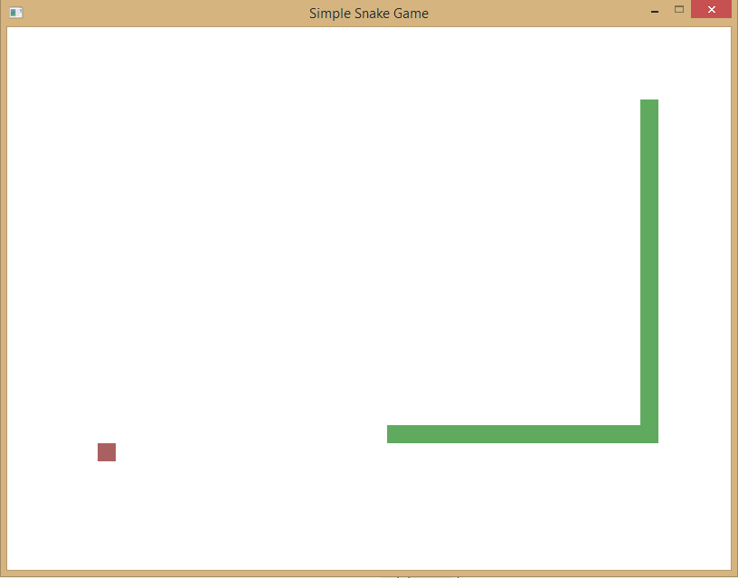

Snake Rust
========

A simple game to test some graphics stuff with Rust.

## Compiling
### Simple
1. Install [SDL 2.0.1 dev](http://libsdl.org/download-2.0.php)
2. Compile and install [rust-sdl2](https://github.com/AngryLawyer/rust-sdl2)
3. In /src/ run `rustc -O main.rs`

### Windows
The easiest way to compile on windows is to do the following:
1. Install [SDL2-devel-2.0.1-mingw](http://libsdl.org/download-2.0.php)
2. Download [rust-sdl2](https://github.com/AngryLawyer/rust-sdl2)
3. Navigate to /rust-sdl2-master/src/sdl2/ 
4. Then run `rustc -O --rlib lib.rs`
5. Copy `libsdl-*.rlib` to /snake-game/src
6. Compile using `rustc -O -L . main.rs`

## Plans
* Basic network multiplayer (waiting on [#11165](https://github.com/mozilla/rust/issues/11165) )
* <del>Swap from SFML to SDL2</del>
* Basic Menu
